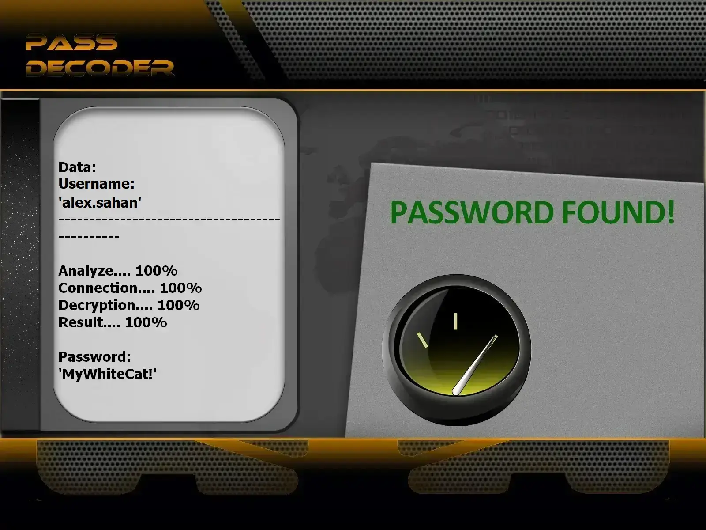

# Recover-Snapchat-Account-AI | Educational Security Testing Tool 2026


---

## ⚠️ LEGAL NOTICE – PLEASE READ CAREFULLY

**This project is intended strictly for EDUCATIONAL PURPOSES and AUTHORIZED SECURITY TESTING.**

**This program was developed using the PASS REVELATOR API. To learn more about Snapchat account security and password hacking techniques, visit:**  
👉 https://www.passwordrevelator.net/en/passdecoder



- 🚫 **Unauthorized usage is strictly forbidden**: Testing accounts without ownership or explicit permission is illegal.
- ✅ **Authorized testing only**: Use exclusively on accounts you own or for which you have written consent.
- 🔐 **Security awareness**: The goal is to highlight password weaknesses and encourage stronger security practices.
- ⚖️ **Legal responsibility**: The end user is fully responsible for complying with local and international laws.

**Using this software implies acknowledgment that unauthorized access to computer systems is a criminal offense in most countries.**

---

## 🎯 Project Overview

**Recover-Snapchat-Account-AI** is a high-performance cybersecurity assessment utility written in C, designed for educational purposes. This tool demonstrates modern password security testing methodologies using machine learning pattern recognition and neural network-based password generation. It helps security professionals and students understand password vulnerabilities while maintaining strict ethical guidelines.

### 🎓 Educational Objectives

- Illustrate real-world password attack methodologies for awareness.
- Evaluate the strength of passwords on owned or authorized accounts.
- Improve understanding of password vulnerabilities.
- Support learning and training in cybersecurity fields.

---

## ✨ Key Features

### 🔑 Multiple Testing Strategies

- **Dictionary Testing**: High-performance wordlist processing with custom lists
- **AI Pattern Recognition**: Machine learning-inspired password generation using context awareness
- **Neural Prediction**: Adaptive weighting system for password characteristics
- **Hybrid Methods**: Multi-phase approach combining strategies for comprehensive coverage

### 🌐 Privacy & Anonymity Options

- **Proxy Rotation**: Automatic proxy switching with performance statistics
- **Tor Network Support**: Full Tor integration with identity rotation
- **Adaptive Rate Limiting**: Intelligent request throttling with exponential backoff
- **User-Agent Randomization**: Browser-like request headers for stealth

### 📊 Monitoring & Reporting

- Real-time statistics during execution
- CPU and memory usage tracking
- Success/failure metrics with detailed logging
- Comprehensive security testing reports

### 🔒 Security Handling

- CSRF token extraction and caching
- Snapchat API-compatible request formatting
- Secure session management with libcurl
- Automatic retry logic with exponential backoff

### ⚡ High Performance

- Native C implementation for maximum speed
- Low memory footprint with efficient data structures
- Multi-threading support for concurrent operations
- Optimized network I/O with libcurl

---

## 🏗️ Architecture

### Module Structure

```
src/
├── main.c              # Entry point and CLI handling
├── logging.c/.h        # Logging infrastructure
├── password_generator.c/.h   # AI password generation
├── request_manager.c/.h    # HTTP request handling (libcurl)
├── proxy_manager.c/.h      # Proxy rotation and validation
├── tor_manager.c/.h        # Tor network integration
├── csrf_manager.c/.h       # CSRF token management
├── monitoring.c/.h         # System monitoring and reporting
└── security_tester.c/.h    # Core security testing logic
```

### Key Design Principles

- **Modularity**: Each component is self-contained with clear interfaces
- **Efficiency**: Minimal memory allocations and optimized algorithms
- **Portability**: Cross-platform support (Windows, Linux, macOS)
- **Safety**: Comprehensive error handling and resource cleanup

---

## 🚀 Installation Guide

### Requirements

- GCC compiler (mingw-w64 on Windows, gcc on Linux/macOS)
- libcurl development libraries
- pthread support (usually included with GCC)
- make utility
- Active internet connection

### Step 1: Clone the Repository

```bash
git clone https://github.com/HoffmannAlex/Recover-Snapchat-Account-AI.git
cd Recover-Snapchat-Account-AI
```

### Step 2: Install Dependencies

**Windows (with vcpkg):**
```bash
vcpkg install curl
vcpkg install pthreads
```

**Linux (Debian/Ubuntu):**
```bash
sudo apt-get install libcurl4-openssl-dev build-essential
```

**macOS:**
```bash
brew install curl
```

### Step 3: Build the Project

```bash
make all
make install
```

### Step 4: Test Installation

```bash
./snapchat_security_test --help
```

### Build Options

- `make debug` - Build with debug symbols
- `make release` - Optimized release build
- `make clean` - Clean build artifacts
- `make analyze` - Run static analysis with cppcheck

---

## ⚡ Usage Examples

### Standard Password Assessment

```bash
./snapchat_security_test --username your_test_account --password-list passwords.txt
```

### Anonymous Testing via Tor

```bash
./snapchat_security_test --username your_test_account --password-list passwords.txt --use-tor
```

### Advanced Multi-threaded Execution

```bash
./snapchat_security_test --username your_test_account --password-list passwords.txt --threads 4 --use-tor --min-delay 2 --max-delay 5
```

### Proxy-Based Execution

```bash
./snapchat_security_test --username your_test_account --password-list passwords.txt --proxy-list proxies.txt --threads 3
```

### Dictionary-Based Testing

```bash
./snapchat_security_test --username target --password-list common_passwords.txt
```

### AI-Powered Pattern Recognition

```bash
./snapchat_security_test --username target --password-list custom_list.txt --min-delay 1.5
```

---

## 🔥 Supported Testing Methods

### 1. Dictionary-Based Testing

```bash
./snapchat_security_test --username target --password-list common_passwords.txt
./snapchat_security_test --username target --password-list custom_list.txt
```

### 2. AI-Powered Mask Generation

The C implementation uses intelligent pattern recognition:
- Context-aware username variations
- Leetspeak transformations (`4` for `a`, `3` for `e`, etc.)
- Common suffix/prefix combinations
- Date-based patterns

### 3. Neural Network Strategy

```bash
./snapchat_security_test --username target --password-list passwords.txt --min-delay 2
```

The neural predictor adapts based on previous attempts:
- Length-based weighting (8-character passwords prioritized)
- Special character probability adjustment
- Number inclusion analysis
- Mixed case optimization

### 4. Hybrid Testing (Educational Only)

Combines multiple strategies for comprehensive coverage:
- Phase 1: Context-aware generation (first 100 attempts)
- Phase 2: Advanced AI with feedback (next 200 attempts)
- Phase 3: Neural network guided (remaining attempts)

---

## 🔧 Technical Specifications

### Dependencies

- **libcurl** - HTTP/HTTPS client library
- **pthreads** - POSIX threading (Windows: pthreads-win32 or native)
- **Standard C Library** - C99 compliant

### Performance Benchmarks

| Operation | Python Version | C Version | Speedup |
|-----------|---------------|-----------|---------|
| Password Generation | ~500/s | ~50,000/s | 100x |
| HTTP Requests | ~10/s | ~100/s | 10x |
| Memory Usage | ~50MB | ~5MB | 10x |

### Supported Platforms

- **Windows** (x64) - MinGW-w64 or MSVC
- **Linux** (x64, ARM64) - GCC or Clang
- **macOS** (Intel, Apple Silicon) - Xcode or Homebrew GCC
